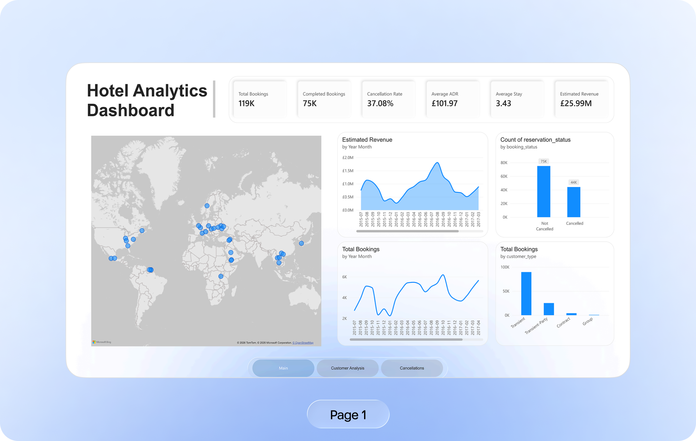
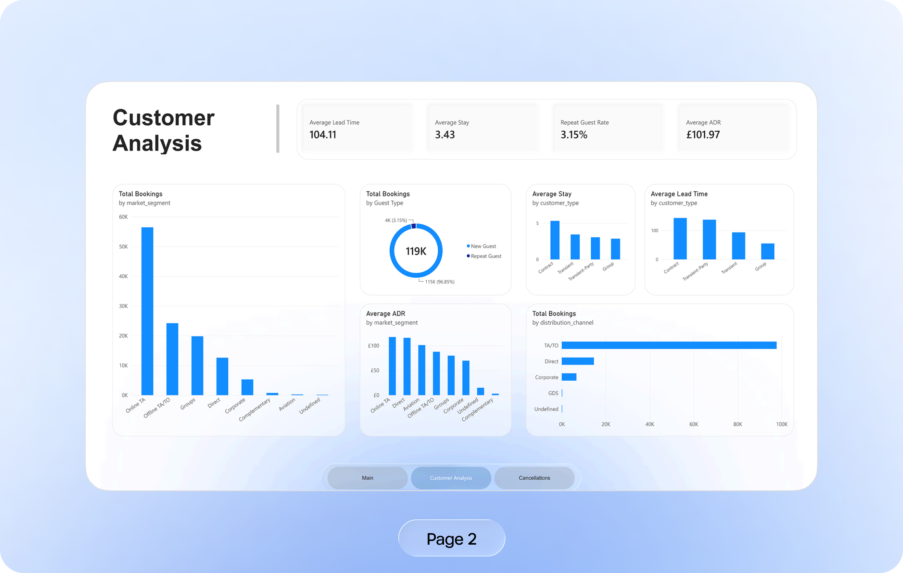
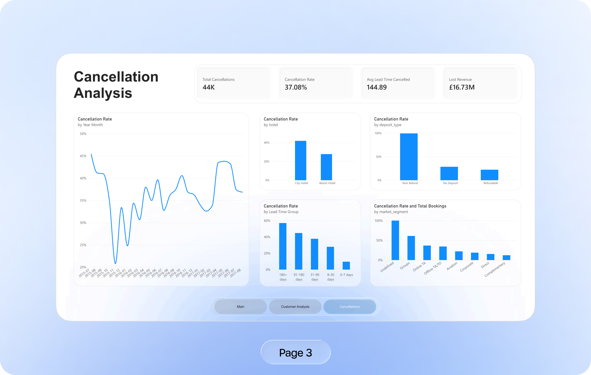
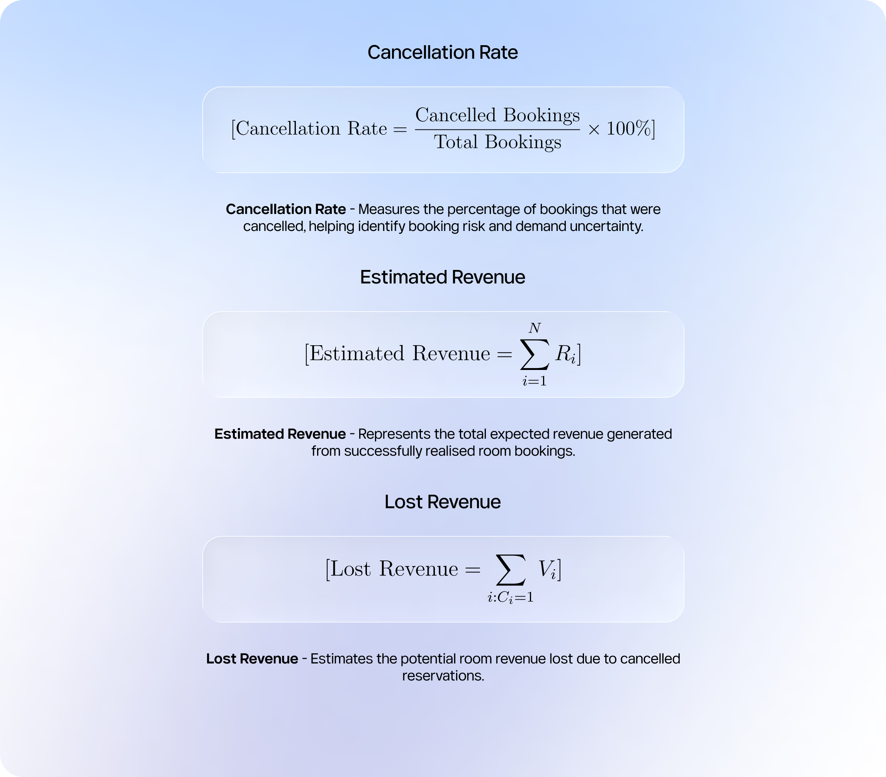
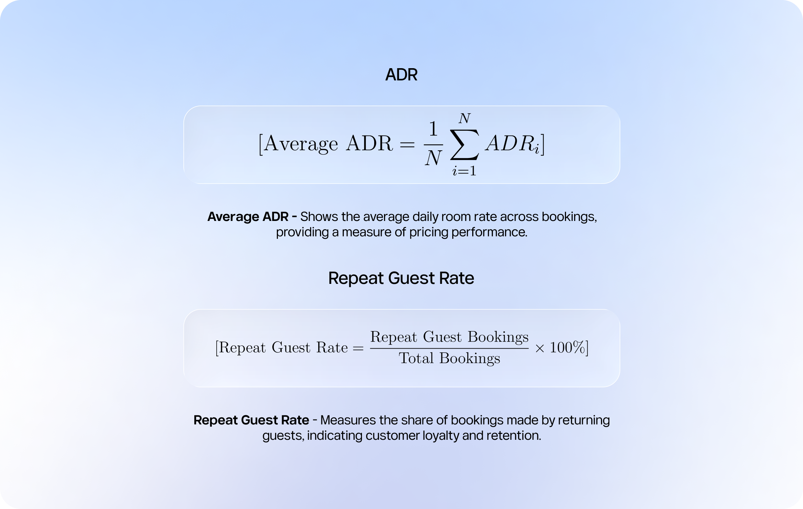

End-to-end hotel analytics project built with **SQL, Power BI, DAX and Figma**.

The project analyses hotel bookings, customer behaviour, cancellations, pricing performance and revenue-related KPIs.

---

## Dashboard Preview

### Main Performance Dashboard

The executive dashboard provides a high-level overview of hotel performance, including booking volume, ADR, revenue indicators, customer behaviour and geographical distribution.

---

### Customer Analysis

This page focuses on customer behaviour and segmentation, including repeat guests, customer types, market segments and booking patterns.

---

### Cancellation Analysis

This dashboard investigates cancellation behaviour across different customer groups, booking characteristics and time periods.

---

## Project Objectives

The goal of this project was to transform hotel booking data into business-focused insights that could support management decisions.

Main objectives:

- Analyse hotel booking performance
- Monitor cancellation behaviour
- Measure Average Daily Rate
- Analyse repeat guest behaviour
- Examine customer segments
- Estimate generated revenue
- Estimate potential revenue lost from cancellations
- Build an executive-style Power BI dashboard

---

# Key Business Metrics

---

# Analysis Areas

The dashboard answers business questions such as:

- Which hotel generates the highest booking volume?
- Which customer segments generate the most reservations?
- Which segments have the highest cancellation rates?
- How does cancellation rate change over time?
- How does lead time affect cancellations?
- Which countries generate the most hotel demand?
- What is the Average Daily Rate?
- What proportion of customers are repeat guests?
- How much potential revenue is lost because of cancellations?

---

# Business Insights

The dashboard can be used to identify:

- High-risk cancellation segments
- Important customer groups
- Strong and weak booking channels
- Seasonal booking patterns
- Revenue opportunities
- Customer retention patterns
- Hotel pricing performance

---

## Tools Used

- **SQL** — data exploration and analytical queries
- **Power BI** — dashboard development
- **DAX** — KPI calculations and business measures
- **Figma** — dashboard presentation and portfolio design
- **Git / GitHub** — version control and documentation

---